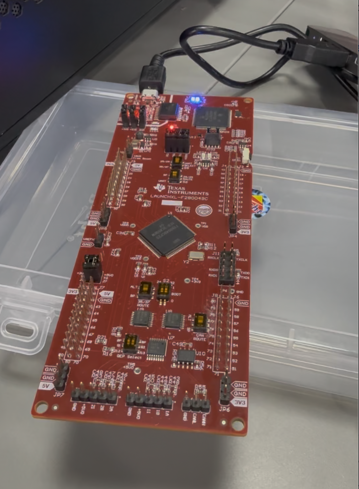

# Lab 01 — GPIO LED Control

## Objective

To configure and control a GPIO pin of the **TMS320F280049C LaunchPad** using C and TI C2000 DriverLib, and to understand the basic workflow of configuring a microcontroller peripheral and controlling a digital output.

---

## Hardware

- **TMS320F280049C LaunchPad**
- USB cable
- On-board LED

### Microcontroller

**Texas Instruments TMS320F280049C**

The TMS320F280049C is a C2000-series microcontroller designed for real-time control applications. In this experiment, its GPIO peripheral is used to control an LED.

---

## Software & Tools

| Tool | Purpose |
|---|---|
| Code Composer Studio (CCS) | Project development, compilation and debugging |
| TI C2000Ware | Device support and DriverLib |
| SysConfig | Peripheral and device configuration |
| C | Firmware development |
| C2000 DriverLib | Hardware abstraction and peripheral control |

---

## Peripheral Used

| Peripheral | Function |
|---|---|
| GPIO | Digital output used to control the LED |

---

## Theory

### GPIO

**General-Purpose Input/Output (GPIO)** pins allow a microcontroller to interact with external digital hardware.

A GPIO pin can generally be configured as either an input or an output. When configured as an output, the microcontroller can drive the pin to a digital **HIGH** or **LOW** state.

In this experiment, a GPIO pin connected to the LaunchPad's LED is configured as a digital output. Changing the state of this GPIO controls the LED.

### GPIO Control Flow

```text
Program Start
     │
     ▼
Device Initialization
     │
     ▼
GPIO Configuration
     │
     ▼
Configure LED Pin as Output
     │
     ▼
Set GPIO HIGH / LOW
     │
     ▼
LED State Changes
```

---

## Implementation

The firmware performs the following operations:

1. Initialize the device.
2. Configure the required GPIO pin.
3. Configure the GPIO pin as an output.
4. Set the initial output state.
5. Control the LED through GPIO operations.

The project uses **TI C2000 DriverLib** functions to configure and control the GPIO peripheral instead of directly manipulating hardware registers.

### Example GPIO Configuration

```c
GPIO_setPadConfig(LED_GPIO, GPIO_PIN_TYPE_STD);
GPIO_setDirectionMode(LED_GPIO, GPIO_DIR_MODE_OUT);
GPIO_writePin(LED_GPIO, 0);
```

The exact GPIO configuration and definitions used by the project can be found in [`lab_main.c`](lab_main.c).

---

## Code Structure

```text
01-led/
│
├── lab_main.c
├── lab_f28004x_launchpad.syscfg
│
├── device/
│   ├── device.c
│   ├── device.h
│   ├── driverlib.h
│   ├── driverlib/
│   └── f28004x_codestartbranch.asm
│
├── targetConfigs/
│   └── TMS320F280049C_LaunchPad.ccxml
│
├── 28004x_generic_flash_lnk.cmd
├── 28004x_generic_ram_lnk.cmd
│
└── images/
    ├── setup.jpg
    ├── led-result.jpg
    └── demo-thumbnail.jpg
```

### Important Files

| File / Directory | Description |
|---|---|
| `lab_main.c` | Main firmware source code |
| `lab_f28004x_launchpad.syscfg` | SysConfig configuration for the LaunchPad |
| `device/` | Device initialization and C2000 DriverLib support |
| `targetConfigs/` | CCS target configuration |
| `*.cmd` | Linker command files for RAM and Flash builds |
| `images/` | Hardware photographs and demonstration media |

---

## Build & Run

### 1. Import the Project

Open **Code Composer Studio** and import the CCS project.

The project contains the required CCS metadata and device configuration files.

### 2. Connect the LaunchPad

Connect the **TMS320F280049C LaunchPad** to the computer using USB.

### 3. Build the Project

Build the project from CCS:

```text
Project → Build Project
```

Resolve any build configuration or device-selection issues before proceeding.

### 4. Load the Program

Launch the configured debug session and load the generated program onto the microcontroller.

### 5. Run

Start program execution and observe the LED connected to the configured GPIO pin.

---

## Results

The GPIO pin was successfully configured as a digital output, and the LED was controlled through firmware running on the **TMS320F280049C**.

The experiment verified the basic process of:

```text
C Firmware
    ↓
DriverLib
    ↓
GPIO Peripheral
    ↓
Digital Output
    ↓
LED
```
---

## Demonstration

Click the image below to watch the hardware demonstration on YouTube.

<p align="center">
  <a href="https://youtube.com/shorts/UwxBQRRc8kU?feature=share">
    
  </a>
</p>

<p align="center">
  <em>Figure 1 — Lab 01 demonstration. Click to watch the video.</em>
</p>

---

## Key Learnings

- Understood the basic GPIO architecture of the TMS320F280049C.
- Learned how to configure a GPIO pin as a digital output.
- Used TI C2000 DriverLib for peripheral configuration.
- Used SysConfig for device and peripheral configuration.
- Understood the CCS build, debug and programming workflow.
- Learned the basic relationship between firmware, peripherals and physical hardware.

---

## Repository Contents

This directory contains the complete CCS project required to build and run the experiment.

The repository includes:

- Firmware source code
- SysConfig configuration
- Device support files
- C2000 DriverLib
- CCS project configuration
- Linker command files
- Target configuration
- Hardware photographs
- Demonstration media

---

## Lab Status

**Status:** Completed

**Platform:** TI TMS320F280049C LaunchPad

**Peripheral:** GPIO

**Language:** C

**IDE:** Code Composer Studio
